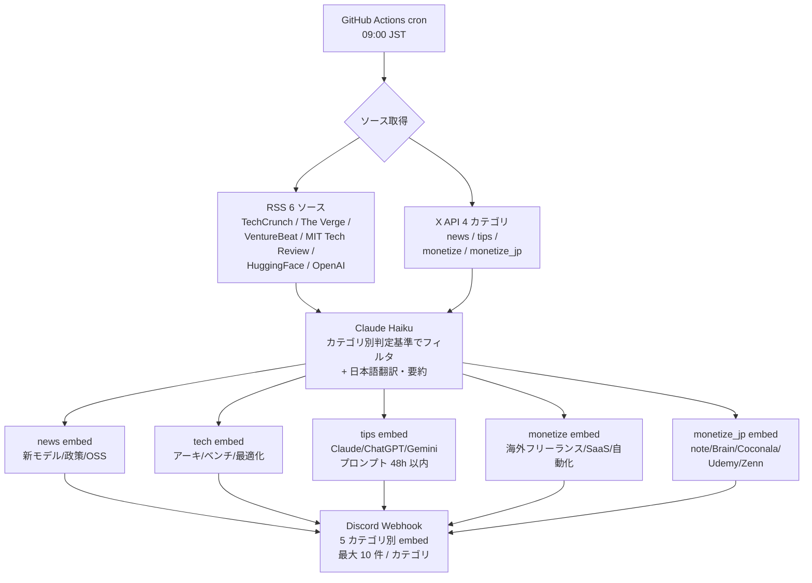
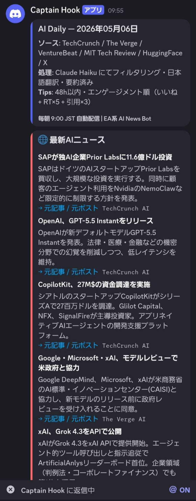

# captain-hook-ai-daily

**AI ニュース毎朝配信 Discord ボット**。RSS（TechCrunch AI / The Verge AI / VentureBeat / MIT Tech Review / HuggingFace Blog / OpenAI News）と X API（OpenAI / Anthropic / Google DeepMind / Meta / mistralai / xAI / nvidia）から最新情報を収集し、Claude Haiku でフィルタリング・日本語翻訳・要約してから Discord に配信します。GitHub Actions の cron で完全クラウド化されており、サーバ運用コストはゼロです。

> **Status**: 自社運用中（2026-04 〜 稼働継続）
> **Author**: tanasato — [restartory.com](https://restartory.com)

---

## なぜ作ったか

最新の AI 業界動向（モデル発表・OSS リリース・実用 Tips）を効率よくキャッチするために、複数の英語情報源を毎朝巡回する必要があった。これを自動化することで、出勤前 10 分の Discord 確認だけで主要トピックを把握できる仕組みにした。

複数のキュレーションサービスを試したが、英語のままだったり広告色が強かったりで定着せず、最終的に「Claude Haiku で自分の判定基準に沿ってフィルタ → 日本語要約」する自前ボットに落ち着いた。

## できること

- **RSS 6 ソース**: TechCrunch AI / The Verge AI / VentureBeat AI / MIT Tech Review / HuggingFace Blog / OpenAI News を毎朝収集
- **X API カテゴリ別取得**:
  - `news`: 主要 AI 公式アカウント（OpenAI / Anthropic / Google DeepMind / Meta / mistralai / xAI / nvidia）
  - `tips`: Claude / ChatGPT / Gemini の最新機能・実践プロンプト（48h 以内・エンゲージメント順）
  - `monetize`: AI 副業マネタイズ（フリーランス / 副業 / SaaS / 自動化）
  - `monetize_jp`: AI 副業マネタイズ（note / Brain / Coconala 等の国内向け）
- **Claude Haiku で 5 カテゴリ別キュレーション**:
  - 各カテゴリの「有益判定基準」を埋め込んだプロンプトでフィルタ
  - 英語記事は日本語に翻訳・要約
- **Discord 通知**: カテゴリごとに色分けされた embed で 10 件ずつ送信
- **GitHub Actions の cron で 09:00 JST 自動実行**

## 技術スタック

| カテゴリ | 採用技術 |
|---|---|
| 言語 | Python 3.13 |
| 標準ライブラリのみ | `urllib.request` / `xml.etree.ElementTree` / `json`（外部依存ゼロ） |
| AI / 外部 API | Anthropic Claude Haiku（フィルタ + 日本語翻訳・要約） |
| データソース | X API v2（OAuth2 Bearer）+ RSS フィード |
| 通知 | Discord Webhook |
| デプロイ・インフラ | GitHub Actions（cron） |

## アーキテクチャ

```
GitHub Actions (cron 09:00 JST)
   │
   ├─ RSS  : TechCrunch AI / The Verge AI / VentureBeat / MIT Tech Review / HuggingFace / OpenAI
   └─ X API: news / tips / monetize / monetize_jp
            │
            ▼
   Claude Haiku（カテゴリ別判定基準でフィルタ + 日本語翻訳・要約）
            │
            ▼
   Discord Webhook（5 カテゴリ別 embed × 最大 10 件 / カテゴリ）
```

## 動作フロー（Mermaid）



各カテゴリの「有益判定基準」は `lib/claude_client.py` の `_CRITERIA` で明示しており、Claude Haiku が一貫した方針でフィルタ・要約します（後述「5 カテゴリのキュレーション基準」セクション参照）。

## 動作スクリーンショット

毎朝 09:00 JST に Discord へ届く `AI Daily` 配信。最新 AI ニュース・技術情報・Tips・国内マネタイズ・海外マネタイズの 5 カテゴリを 1 メッセージで配信します。



> Bot 名「Captain Hook」は Discord Webhook の送信元設定で、本ボット自身のラベルです。

## セットアップ（ローカル実行）

1. Python 3.13+ を用意
2. `.env.example` を `.env` にコピーして以下の値を設定:

   ```env
   X_BEARER_TOKEN=...   # https://developer.x.com の Bearer Token
   DISCORD_WEBHOOK=...  # Discord チャンネルの Webhook URL
   ANTHROPIC_API_KEY=... # https://console.anthropic.com の API Key
   ```

3. 実行:

   ```bash
   python ai_news_discord.py
   ```

外部依存パッケージは不要（標準ライブラリのみで動作）。

## GitHub Actions 運用

`.github/workflows/daily.yml` が毎日 `09:00 JST`（`00:00 UTC`）に実行されます。

GitHub Secrets に以下を設定してください:

- `X_BEARER_TOKEN`
- `DISCORD_WEBHOOK`
- `ANTHROPIC_API_KEY`

## 5 カテゴリのキュレーション基準

各カテゴリの「有益記事」判定基準は `lib/claude_client.py` の `_CRITERIA` に明示されており、以下のような項目を含みます:

- **news**: 新モデル / 製品リリース、主要企業発表、AI 規制・政策、OSS リリース、資金調達
- **tech**: 新アーキテクチャ、ベンチマーク、推論最適化、新 API / コンテキスト長拡張
- **tips**: Claude / ChatGPT / Gemini の新機能、48h 以内の実践プロンプト
- **monetize**: AI 個人マネタイズ全般（コンテンツ / フリーランス / SaaS / 自動化）
- **monetize_jp**: 国内プラットフォーム（note / Brain / Coconala / Udemy / Zenn 等）

「マーケティング寄りの定性的な話」「投資・暗号資産」「企業向け B2B 事例」は明示的に除外しています。

## 工夫点・技術的判断

### 1. カテゴリ別判定基準のプロンプト埋め込み

複数キュレーションサービスを試した結果、汎用的な「重要そうなニュース」フィルタは「自分が知りたいもの」と一致しないことが分かった。`lib/claude_client.py` の `_CRITERIA` にカテゴリ別の有益判定基準（含めるトピック / 除外するトピック）を明示し、Claude Haiku が一貫した方針でフィルタ・要約する設計を採用。基準を変更したい場合は dict を書き換えるだけで済む。

### 2. 標準ライブラリのみで動作（外部依存ゼロ）

`requests` も `feedparser` も使わず、Python 標準の `urllib.request` + `xml.etree.ElementTree` だけで動作。GitHub Actions の依存解決時間を最小化し、ライブラリ脆弱性のサプライチェーンリスクを排除。

### 3. 48h 鮮度フィルタ + エンゲージメント順（tips カテゴリ）

`tips` カテゴリは情報の鮮度が命のため、48 時間以内の投稿に限定 + エンゲージメント数（いいね + RT × 5 + 引用 × 3）で並び替え。「古いけど話題」より「新しくて伸びている」を優先する。

### 4. 5 カテゴリ embed 色分け

Discord での視認性を高めるため、`news` / `tech` / `tips` / `monetize` / `monetize_jp` で embed 色を変える。スクロール時に「自分の興味カテゴリ」を瞬時に識別可能。

### 5. ログを残さない設計

キュレーション結果はリポジトリ・ローカルファイルに保存せず、Discord 配信のみ。情報漏洩リスクを最小化し、運用上の dependent state（DB / S3 など）も持たない。

### 6. X API ハンドリング

X API v2 の Rate Limit / 401 / 429 を `try/except` で個別ハンドリングし、1 カテゴリ失敗が他カテゴリの収集を止めない設計。

## 成果・指標

| 指標 | Before | After |
|---|---|---|
| AI 業界動向のキャッチ時間 | 朝 30〜45 分（複数サイト巡回） | **朝 10 分（Discord 確認のみ）** |
| 月次稼働時間の節約 | — | **約 15〜20 時間/月** |
| 言語的ハードル | 英語ソース読解 | 日本語要約に変換済 |
| サーバ運用コスト | — | **0 円**（GitHub Actions 無料枠内で完結） |
| AI / 通信コスト | — | Claude Haiku 利用料の従量課金のみ（1 日あたり数円程度） |

## この実績が武器になる案件

- AI を活用した社内 / 個人向け **情報自動収集ツール構築**
- LLM プロンプトエンジニアリング（カテゴリ別判定基準の言語化）
- マルチソース正規化（RSS + REST API）+ Webhook 配信パイプライン
- 外部依存を持たない **Python 軽量 ETL**（標準ライブラリのみ・運用コスト最小化が要件のシステム）

## 注意

- X API は v2 の Bearer Token 認証を使用しています。各ソースの利用規約に従ってください。
- 実行ログ・キュレーション結果はリポジトリには保存されません（必要なら別途ストレージへ）。

## ライセンス

このリポジトリは個人ポートフォリオ用途で公開しています。商用での流用・転載は事前にご相談ください。
